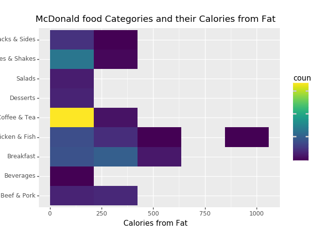

# Hack-a-thing 1: Data Visualization

## Team Members: Stephen Liao and Shirley Xinyi Zhang

### Pivot 1: Data Visualization with Pandas
#### Managing Sneks (Python) with Conda (a sad story by Stephen)
[https://conda.io/docs/index.html] "Conda is an open source package management system and environment management system that runs on Windows, macOS and Linux."

As we work with Python and several data visualization libraries such as `pandas` and `seaborn`, Conda helps us maintain our development environment.

- I start by creating a new Python 3 environment `conda create --name pandas_tutorial python=3.6`.

- Installing `pandas` is as easy as running `conda install pandas`.

Ok turns out this was **not as easy as I thought it would be**. I ended up following the kaggle tutorial with PyCharm's virtual environment and installing packages with pip..which leads me to:

#### Semi-Success Story Told by Shirley - Plotnine & Panda

I could install pandas and plotnine using pip. I followed the tutorial using a wine dataset, and found two other datasets to visualize- McDonald's menu and restaurant ratings. 

I tried using simple graphs and more fancy looking graphs with themes. However I realized quickly that this was not going to become any more interesting unless I had access to some cool datasets which was more of a finding problem than a CS problem.

### Unity 
#### Zombie Game - Shirley

This game is made from a tutorial on Unity.com
I followed the ten phases: environment set up, setting characters, setting camera, creating two enemies, creating UI component HUD, adding player health, ability to damage health, score points, randomly spawn multiple enemies, and adding game over video
The goal of the game is to shoot the zombunny and zombears that come attacking you!

Zombie attack!

Game over video screenshot

shooting the zombies/ dust particles

#### Barista Training - Stephen

I attempted to make a barista training scene where the user can pick up a cup and fill it up with liquid. I used SteamVR and VRTK.

I looked into the standard assets for water and liquid, but found that they were mainly for landscaping and scenic water, but not for interacting with it. I found a library called Fluvio (free version) that creates a fluid particle system. My objective was to mirror a barista filling up a cup with coffee.

Turns out that there is a documented bug with Fluvio where fluid doesn't correctly interact with mesh colliders. This made me sad, as I wanted to fill up a hollow container (a cup). Without a mesh collider for the shape of the cup, I hacked together an open box of box colliders (leaving the top open).

Here's an in-game view

Here's some flaky-looking liquid falling into the cup...and through it, into the void.

My takeways: VR projects are hard because they require piecing together many different libraries and assets. Sometimes the behaviors and interactions between them do not go as expected. Still, it was a lot of fun to work with various VR technologies and go shopping for free cup assets in the Unity store.

